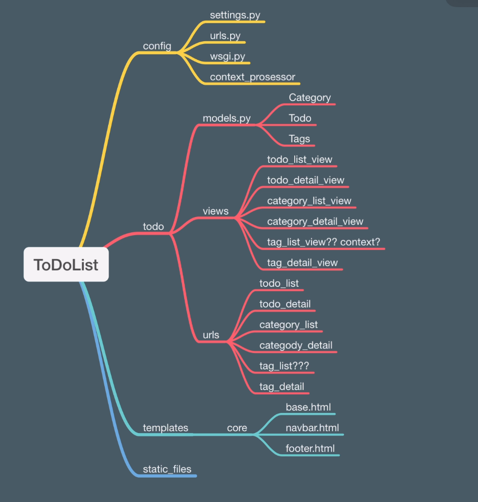

# Django Todo Uygulaması:
Bu uygulama, kullanıcıların yapılacaklar listesi oluşturmasına olanak tanır. Kullanıcılar, yapılacak görevlerin başlığını, açıklamasını ve bitiş tarihini girerek yeni bir görev oluşturabilirler. Ayrıca, kullanıcılar yapacakları görevleri tamamladıklarında, tamamlandı olarak işaretleyebilirler.

## Kurulum

1. Bu projeyi klonlayın:
    ```
    git clone https://github.com/Semihocakli/TodoApp-Django.git
    ```
2. Virtualenv kurun ve etkinleştirin:
    ```
    virtualenv env
    source env/bin/activate
    ```
3. Gerekli bağımlılıkları yükleyin:
    ```
    pip install -r requirements.txt
    ```
4. Veritabanını oluşturun:
    ```
    python manage.py makemigrations
    python manage.py migrate

    ```
5. Yönetici hesabı oluşturun:
    ```
    python manage.py createsuperuser

    ```
6. Sunucuyu başlatın:
    ```
    python manage.py runserver
    ```
7. Tarayıcınızda `http://localhost:8000` adresine gidin ve uygulamayı görüntüleyin.

## Kullanım

- Yapılacaklar listesine erişmek için tarayıcınızda `http://localhost:8000/todos` adresine gidin.
- Yeni bir yapılacak eklemek için "Yeni Todo Ekle" düğmesine tıklayın.
- Yapılacakları düzenlemek için ilgili todo'nun yanındaki "Düzenle" düğmesine tıklayın.
- Yapılacakları silmek için ilgili todo'nun yanındaki "Sil" düğmesine tıklayın.


### Projenin Amaçları:
* Model Yapısını Anlamak
* Django ORM Query ile Çalışmak
* MVT İlişkisini Anlamak
* Django Shell Kullanımını Anlamak
* Django Shell'de Query Kullanımı
* OneToOneField, ForeignKey ve ManyToManyField Yapılarını Anlamak
* Context Prosessor ile Genel Verileri Site içerisinde Kullanmak
* DEBUG Mode
* Settings Dosyasını Daha Fazla Tanımak



## Django ORM Query:
```shell
python manage.py shell
```

```python
# Todo Modelini import etmek:
from todo.models import Todo

# Tum Objeler:
Todo.objects.all()

# Tum objeleri say:
Todo.objects.all().count()

# Yeni Todo olusturmak:
Todo.objects.create(title="Shell Uzerinden Olusturulan Todo")
Todo.objects.create(title="Shell Uzerinden Yeni Olusturulan Todo", is_active=True)

# is_active olanlari goster
Todo.objects.filter(is_active=True)  # SELECT * FROM todo WHERE is_active=True

# is_active olanlari say:
Todo.objects.filter(is_active=True).count()

# UPDATE:
# Yapilan sorguya uyan objelerin istenilen alanlari degistirilebilir..
Todo.objects.filter(is_active=False).update(is_active=True)

# Title icinde Django gecmeyenleri bul ve Django ekle
todos = Todo.objects.exclude(title__icontains="django")

for item in todos:
    item.title = f"{item.title} - Django"
    item.save()
```